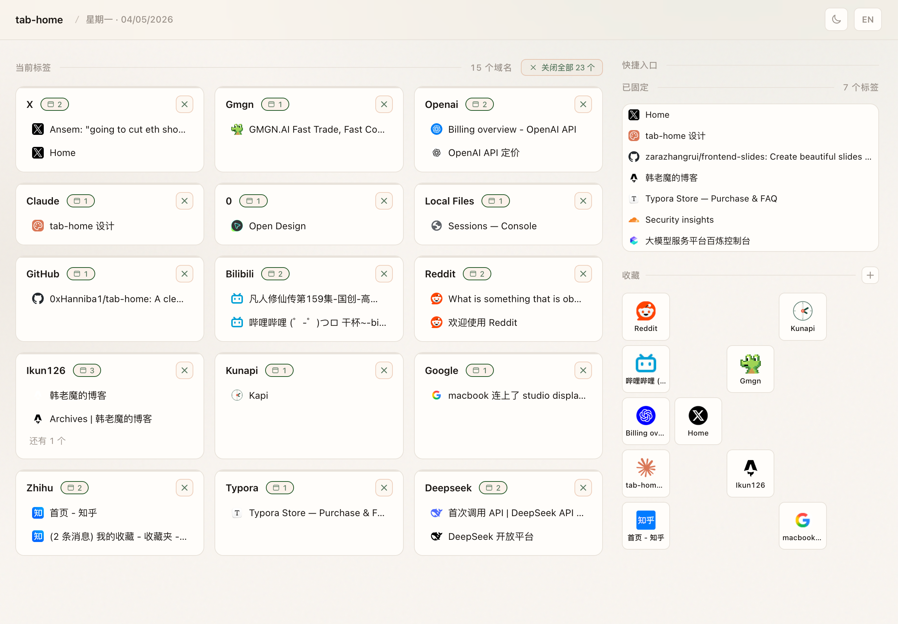

# tab-home

**让新标签页变成一个真正能用的个人仪表板。**

tab-home 是一个 Chrome 新标签页扩展。它把默认的新标签页替换成一个干净的工作台：左侧整理当前打开的标签页，右侧放固定标签、常用网站和长期收藏。

它完全本地运行。无服务器、无账号、不上传数据。

本仓库是 [0xHanniba1/tab-home](https://github.com/0xHanniba1/tab-home) 的个人维护版本，fork 自 [WolfyXBT/tab-home](https://github.com/wolfyxbt/tab-home)，上游项目基于 [Zara/tab-out](https://github.com/zarazhangrui/tab-out)。



---

## 你会得到什么

- **Open tabs**：当前打开的普通标签页，按域名自动分组
- **Pinned**：Chrome 里的固定标签页，独立显示在右侧顶部
- **Favorites**：长期收藏的网站，支持拖拽排序、自定义 logo 和右键添加
- **Quick Access**：把固定标签和长期收藏放在一起，作为新标签页的快捷入口
- **重复标签提示**：同 URL 多开时显示重复数量，一键关闭多余标签
- **深浅主题**：右上角切换，设置保存在本地
- **中英文界面**：右上角切换语言
- **本地数据**：收藏、标题覆盖、主题和语言都存在 `chrome.storage.local`

核心判断很简单：新标签页不应该只是一个搜索框。它应该帮你回到正在做的事。

---

## 功能细节

### 标签页整理

- 普通标签按域名分组
- 固定标签和普通标签分开显示
- 每个标签都有快捷操作：
  - 加入 / 移出收藏
  - 固定 / 取消固定
  - 关闭当前标签
  - 关闭重复标签
- 常用的标签组会排在前面；使用次数相同时，最近活跃的标签组优先
- 浏览器其他窗口里开关标签后，页面会自动刷新

### 收藏管理

- 点击 `+` 添加 URL
- 鼠标悬停收藏项可以编辑或删除
- 支持拖拽排序
- 收藏数量没有硬上限，列表超出高度后滚动
- 标题留空时，会从 URL 自动推导名称
- 图标优先使用站点高质量 favicon，并缓存到本地
- 支持上传 logo，也支持直接粘贴剪贴板图片

### 右键菜单

- 在页面右键：`Add page to tab-home favorites`
- 在链接右键：`Add link to tab-home favorites`

### 隐私

tab-home 没有服务器。

它不需要账号，也不会把你的标签页、收藏、浏览习惯上传到任何地方。数据只存在 Chrome 本地扩展存储里。

---

## 安装

### 1. Clone 仓库

```bash
git clone https://github.com/0xHanniba1/tab-home.git
cd tab-home
```

### 2. 加载到 Chrome

打开 Chrome 扩展管理页：

```text
chrome://extensions
```

然后：

1. 打开右上角 **开发者模式**
2. 点击 **加载已解压的扩展程序**
3. 选择本仓库里的 `extension/` 文件夹
4. 打开一个新标签页

你会看到 tab-home。

### 3. 更新

```bash
git pull
```

然后回到 `chrome://extensions`，找到 tab-home，点重新加载。

---

## 本地开发

这个项目是纯 Chrome 扩展：

- 无 Node.js 依赖
- 无 npm install
- 无构建步骤
- 直接加载 `extension/` 即可运行

目录结构：

```text
extension/
  app.js          # 事件绑定和交互入口
  background.js   # 右键菜单和后台逻辑
  domain.js       # 域名归类和分组规则
  favorites.js    # 收藏存储、迁移和排序
  icons.js        # favicon 获取与缓存
  render.js       # 页面渲染
  settings.js     # 语言、主题、文案
  tabs.js         # Chrome tabs API 包装
  ui.js           # toast、动效、日期等 UI 辅助
```

运行测试：

```bash
for f in tests/*.test.js; do node "$f"; done
```

测试覆盖：

- 模块加载
- 图标解析
- 标签分组布局
- Pinned / Favorites 排列
- Quick Access 布局
- 标题覆盖
- 悬停按钮行为

---

## 自定义

可以创建一个本地配置文件：

```text
extension/config.local.js
```

这个文件已被 `.gitignore` 忽略，适合放个人规则，比如：

- 自定义某些域名的分组方式
- 自定义 landing page 匹配规则
- 调整自己的常用站点归类

参考代码里的：

```text
LOCAL_LANDING_PAGE_PATTERNS
LOCAL_CUSTOM_GROUPS
```

---

## 技术栈

| 用途 | 实现 |
| --- | --- |
| 扩展协议 | Chrome Manifest V3 |
| 数据存储 | `chrome.storage.local` |
| 标签页管理 | `chrome.tabs` |
| 右键菜单 | `chrome.contextMenus` |
| 图标缓存 | favicon fallback + base64 cache |
| UI | HTML / CSS / JavaScript |
| 动效 | CSS transitions + JS particles |
| 音效 | Web Audio API |
| 多语言 | 内置 i18n 字符串表 |

---

## License

MIT

---

Credits:

- Forked from [WolfyXBT/tab-home](https://github.com/wolfyxbt/tab-home)
- Based on [Zara/tab-out](https://github.com/zarazhangrui/tab-out)
